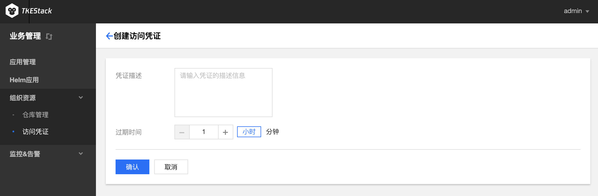

# 访问凭证

**这里用户可以管理自己的凭据。**

## 新建访问凭证

1. 登录 TKEStack。
2. 切换至 【业务管理】控制台，选择【组织资源】-&gt;【访问凭证】，点击【新建】按钮。

3. 在弹出“创建访问凭证”页面，填写凭证信息。如下图所示：

   * 凭证描述：描述当前凭证信息
   * 过期时间：填写过期时间，选择小时/分钟为单位

4. 单击【确认】按钮

## 停用/启用/删除访问凭证

1. 登录 TKEStack。
2. 切换至 【业务管理】控制台，选择 【组织资源】-&gt; 【访问凭证】，查看“访问凭证”列表。单击列表右侧【禁用】/【启用】/【删除】按钮。如下图所示：

   > 注意：点击【禁用】之后，【禁用】按钮就变成了【启用】

3. 单击【确认】按钮

