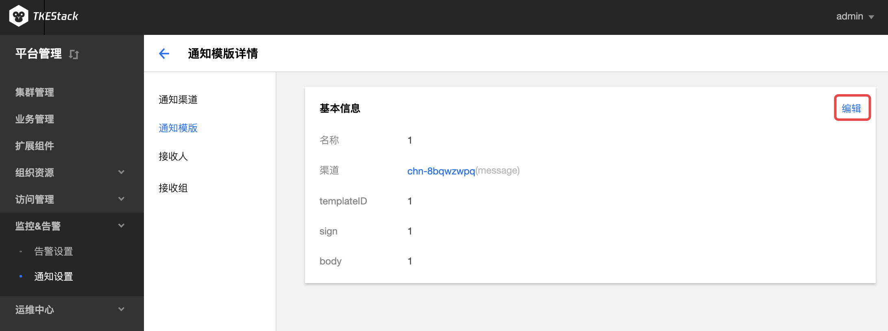
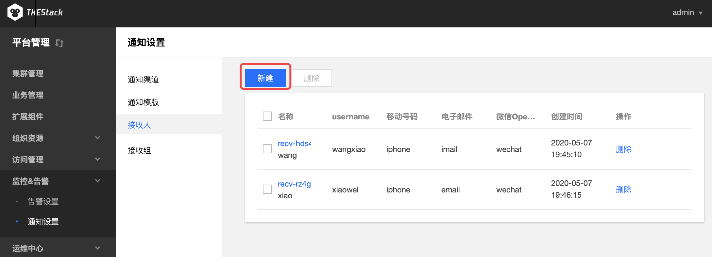

# 通知设置

## 概念

**这里用户配置平台通知。**

## 操作步骤

这部分和【平台管理】控制台下【监控&告警】下的【通知设置】完全一致。故这里使用【平台管理】控制台下的截图。

### 通知渠道

#### 新建通知渠道

1. 登录 TKEStack。
2. 切换至【业务管理】控制台，选择 【监控&告警】-&gt;【通知设置】-&gt;【通知渠道】，查看“通知渠道”列表。
3. 点击【新建】按钮。如下图所示：

   

4. 在“新建通知渠道”页面填写渠道信息。如下图所示： 
   * **名称：** 填写渠道名称
   * **渠道：** 选择渠道类型，输入渠道信息
   * **邮件：** 邮件类型
     * **email：** 邮件发送放地址
     * **password：** 邮件发送方密码
     * **smtpHost：** smtp IP地址
     * **smtpPort：** smtp端口
     * **tls：**  是否tls加密
   * **短信：** 短信方式
     * **appKey：** 短信发送方的appKey
     * **sdkAppID：** sdkAppID
     * **extend：** extend 信息
   * **微信公众号：** 微信公众号方式
     * **appID：** 微信公众号appID
     * **appSecret：** 微信公众号app密钥
5. 单击【保存】按钮。

#### 编辑通知渠道

1. 登录 TKEStack。
2. 切换至【业务管理】控制台，选择 【监控&告警】-&gt;【通知设置】-&gt;【通知渠道】，查看“通知渠道”列表。
3. 单击渠道名称。如下图所示：

   

4. 在“基本信息”页面，单击【基本信息】右侧的【编辑】按钮。如下图所示：

   

5. 在“更新渠道通知”页面，编辑渠道信息。
6. 单击【保存】按钮。

#### 删除通知渠道

1. 登录 TKEStack。
2. 切换至【业务管理】控制台，选择 【监控&告警】-&gt;【通知设置】-&gt;【通知渠道】，查看“通知渠道”列表。
3. 选择要删除的渠道，点击【删除】按钮。如下图所示：

   

4. 单击删除窗口的【确定】按钮。

### 通知模板

#### 新建通知模版

1. 登录 TKEStack。
2. 切换至【业务管理】控制台，选择 【监控&告警】-&gt;【通知设置】-&gt;【通知模板】，查看“通知模板”列表。
3. 点击【新建】按钮。如下图所示：

   

4. 在“新建通知模版”页面填写模版信息。如下图所示： 
   * **名称：** 模版名称
   * **渠道：** 选择已创建的渠道
   * **body：** 填写消息body体
   * **header：** 填写消息标题
5. 单击【保存】按钮。

#### 编辑通知模版

1. 登录 TKEStack。
2. 切换至【业务管理】控制台，选择 【监控&告警】-&gt;【通知设置】-&gt;【通知模板】，查看“通知模板”列表。
3. 单击模版名称。如下图所示：

   

4. 在基本信息页面，单击【基本信息】右侧的【编辑】按钮。如下图所示：

   

5. 在“更新通知模版”页面，编辑模版信息。
6. 单击【保存】按钮。

#### 删除通知模版

1. 登录 TKEStack。
2. 切换至【业务管理】控制台，选择 【监控&告警】-&gt;【通知设置】-&gt;【通知模板】，查看"通知模板"列表。
3. 选择要删除的模版，点击【删除】按钮。如下图所示：

   

4. 单击删除窗口的【确定】按钮。

### 接收人

#### 新建接收人

1. 登录 TKEStack。
2. 切换至【业务管理】控制台，选择 【监控&告警】-&gt;【通知设置】-&gt;【接收人】，查看"接收人"列表。
3. 点击【新建】按钮。如下图所示：

   

4. 在“新建接收人”页面填写模版信息。如下图所示： 
   * **显示名称：** 接收人显示名称
   * **用户名：** 接收人用户名
   * **移动电话：** 手机号
   * **电子邮件：** 接收人邮箱
   * **微信OpenID：** 接收人微信ID
5. 单击【保存】按钮。

#### 编辑接收人信息

1. 登录 TKEStack。
2. 切换至【业务管理】控制台，选择 【监控&告警】-&gt;【通知设置】-&gt;【接收人】，查看“接收人”列表。
3. 单击接收人名称。如下图所示：

   

4. 在“基本信息”页面，单击【基本信息】右侧的【编辑】按钮。如下图所示：

   

5. 在“更新接收人”页面，编辑接收人信息。
6. 单击【保存】按钮。

#### 删除接收人

1. 登录 TKEStack。
2. 切换至【业务管理】控制台，选择 【监控&告警】-&gt;【通知设置】-&gt;【接收人】，查看“接收人”列表。
3. 选择要删除的接收人，点击【删除】按钮。如下图所示：

   

4. 单击删除窗口的【确定】按钮。

### 接收组

#### 新建接收组

1. 登录 TKEStack。
2. 切换至【业务管理】控制台，选择 【监控&告警】-&gt;【通知设置】-&gt;【接收组】，查看“接收组”列表。
3. 点击【新建】按钮。如下图所示：

   

4. 在“新建接收组”页面填写模版信息。如下图所示： 
   * **名称：** 接收组显示名称
   * **接收组：** 从列表里选择接收人。如没有想要的接收人，请在[接收人](notifier.md#接收人)里创建。
5. 单击【保存】按钮。

#### 编辑接收组信息

1. 登录 TKEStack。
2. 切换至【业务管理】控制台，选择 【监控&告警】-&gt;【通知设置】-&gt;【接收组】，查看“接收组”列表。
3. 单击接收组名称。如下图所示：

   

4. 在“基本信息”页面，单击【基本信息】右侧的【编辑】按钮。如下图所示：

   

5. 在“更新接收组”页面，编辑接收组信息。
6. 单击【保存】按钮。

#### 删除接收组

1. 登录 TKEStack。
2. 切换至【业务管理】控制台，选择 【监控&告警】-&gt;【通知设置】-&gt;【接收组】，查看“接收组”列表。
3. 选择要删除的接收组，点击【删除】按钮。如下图所示：

   

4. 单击删除窗口的【确定】按钮。

