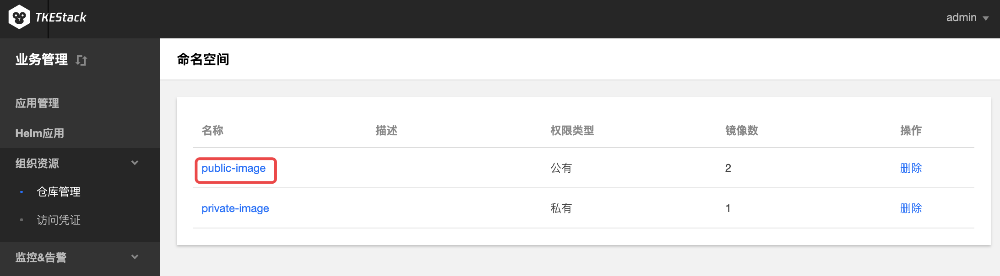

# 仓库管理

**这里用户可以管理镜像仓库。**

> 注意：TKEStack的【业务管理】控制台不支持命名空间的创建，可以在【平台管理】下的[【组织资源】](../../platform-console/registry-mgmt/)下的【镜像仓库管理】新建命名空间。

## 删除命名空间

1. 登录 TKEStack。
2. 切换至 【业务管理】控制台，选择 【组织资源】-&gt;【仓库管理】。点击列表最右侧【删除】按钮。如下图所示：
3. 点击【确认】

### 镜像上传

1. 登录 TKEStack。
2. 切换至 【业务管理】控制台，选择 【组织资源】-&gt;【仓库管理】，查看“命名空间”列表。点击列表中命名空间【名称】。如下图所示： 
3. 此时进入了“镜像列表”页面，点击【镜像上传指引】按钮。如下图所示：

   > 注意：此页面可以通过上传的镜像最右边的【删除】按钮来删除上传的镜像

4. 根据指引内容，在物理节点上执行相应命令。如下图所示：

